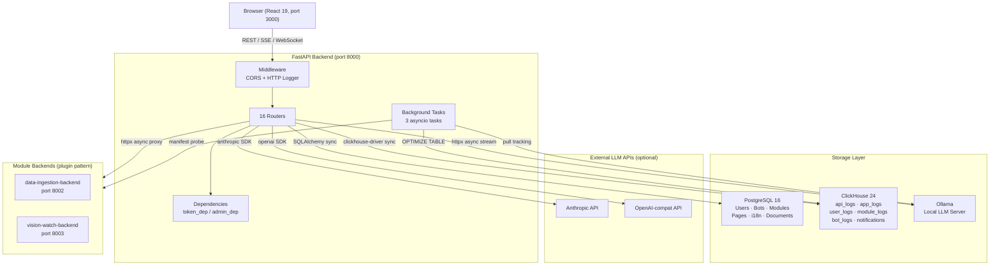

# System Architecture

High-level view of all services, storage backends, and external integrations.

```mermaid
graph TB
    Browser["Browser (React 19, port 3000)"]

    subgraph FastAPI["FastAPI Backend (port 8000)"]
        MW["Middleware\nCORS + HTTP Logger"]
        Routers["16 Routers"]
        Deps["Dependencies\ntoken_dep / admin_dep"]
        BG["Background Tasks\n3 asyncio tasks"]
    end

    subgraph Storage["Storage Layer"]
        PG["PostgreSQL 16\nUsers · Bots · Modules\nPages · i18n · Documents"]
        CH["ClickHouse 24\napi_logs · app_logs\nuser_logs · module_logs\nbot_logs · notifications"]
        OLL["Ollama\nLocal LLM Server"]
    end

    subgraph External["External LLM APIs (optional)"]
        ANT["Anthropic API"]
        OAI["OpenAI-compat API"]
    end

    subgraph Modules["Module Backends (plugin pattern)"]
        MB1["data-ingestion-backend\nport 8002"]
        MB2["vision-watch-backend\nport 8003"]
    end

    Browser -->|"REST / SSE / WebSocket"| MW
    MW --> Routers
    Routers --> Deps
    Routers -->|"SQLAlchemy sync"| PG
    Routers -->|"clickhouse-driver sync"| CH
    Routers -->|"httpx async stream"| OLL
    Routers -->|"httpx async proxy"| Modules
    BG -->|"pull tracking"| OLL
    BG -->|"OPTIMIZE TABLE"| CH
    BG -->|"manifest probe"| Modules
    Routers -->|"anthropic SDK"| ANT
    Routers -->|"openai SDK"| OAI
```
