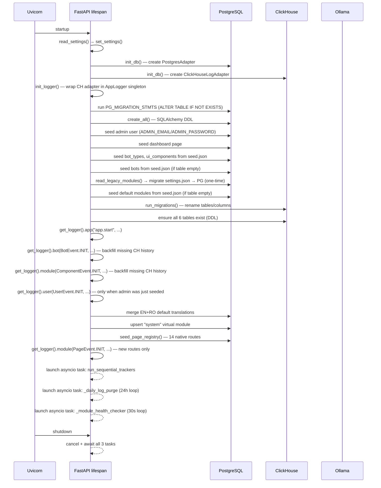

# Application Startup Sequence

The full boot process inside `lifespan()` in `main.py`. Auto-discovery from `MODULE_REGISTRY_URLS` was removed — modules are now registered exclusively via the admin-triggered `GET /api/settings/modules/discover` endpoint.

## What changed

| Before | After |
|---|---|
| `MODULE_REGISTRY_URLS` probed at every startup | Removed — use `GET /api/settings/modules/discover` instead |
| Direct `ch.write_*` calls throughout startup | All writes via `get_logger().*` (AppLogger singleton) |
| `init_logger()` did not exist | Initialised immediately after `init_db()` |
