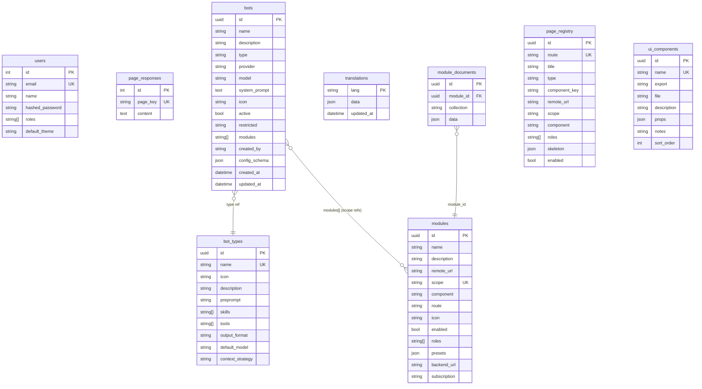

# PostgreSQL Schema

All 9 SQLAlchemy ORM tables, their columns, and relationships. Defined in `backend/app/db/postgres/orm.py`.

```mermaid
erDiagram
    users {
        int id PK
        string email UK
        string name
        string hashed_password
        string[] roles
        string default_theme
    }
    page_responses {
        int id PK
        string page_key UK
        text content
    }
    bot_types {
        uuid id PK
        string name UK
        string icon
        string description
        string preprompt
        string[] skills
        string[] tools
        string output_format
        string default_model
        string context_strategy
    }
    bots {
        uuid id PK
        string name
        string description
        string type
        string provider
        string model
        text system_prompt
        string icon
        bool active
        string restricted
        string[] modules
        string created_by
        json config_schema
        datetime created_at
        datetime updated_at
    }
    translations {
        string lang PK
        json data
        datetime updated_at
    }
    modules {
        uuid id PK
        string name
        string description
        string remote_url
        string scope UK
        string component
        string route
        string icon
        bool enabled
        string[] roles
        json presets
        string backend_url
        string subscription
    }
    module_documents {
        uuid id PK
        uuid module_id FK
        string collection
        json data
    }
    page_registry {
        uuid id PK
        string route UK
        string title
        string type
        string component_key
        string remote_url
        string scope
        string component
        string[] roles
        json skeleton
        bool enabled
    }
    ui_components {
        uuid id PK
        string name UK
        string export
        string file
        string description
        json props
        string notes
        int sort_order
    }

    bots }o--|| bot_types : "type ref"
    module_documents }o--|| modules : "module_id"
    bots }o--o{ modules : "modules[] (scope refs)"
```
