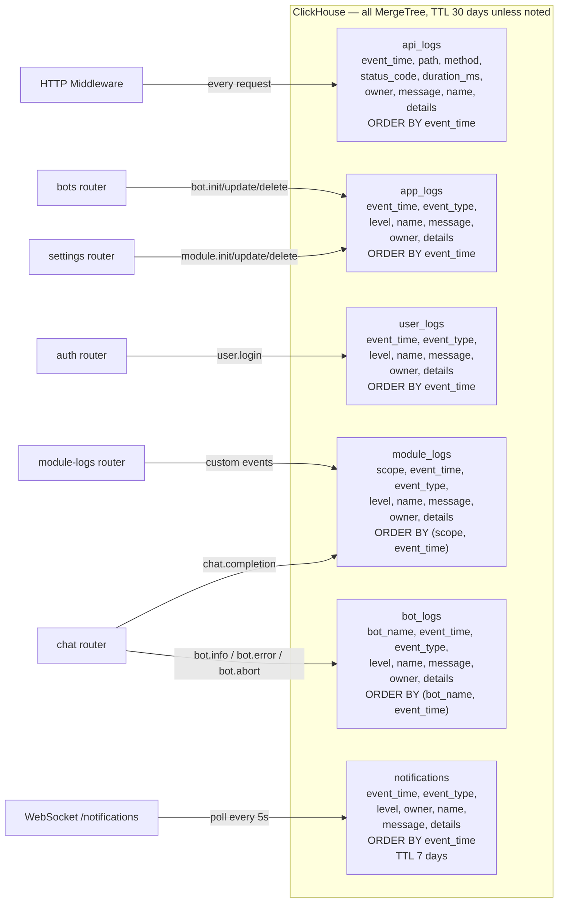

# ClickHouse Tables

6 append-only MergeTree tables with 30-day TTL (notifications: 7 days). No materialized views — summaries are computed via live GROUP BY queries. Defined in `backend/app/db/clickhouse/adapter.py`.

