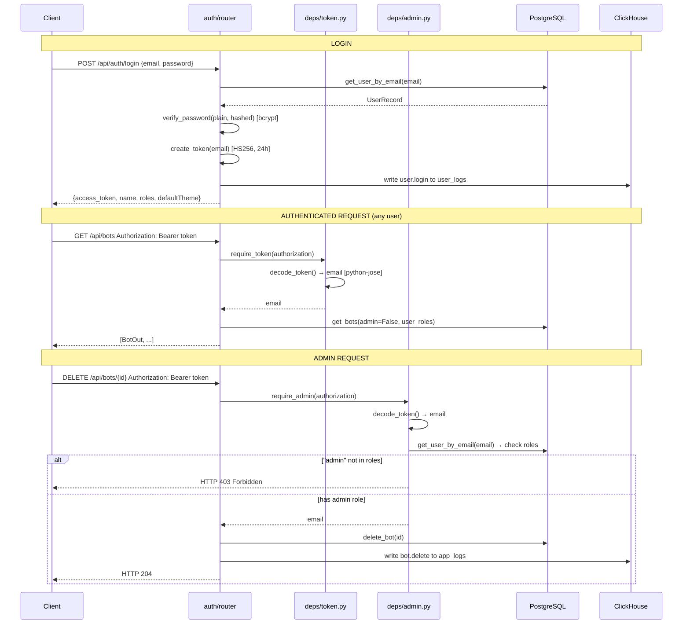

# Authentication & Authorization Flow

Login produces a 24-hour HS256 JWT. Every subsequent request validates it via `token_dep` (any user) or `admin_dep` (role check in PostgreSQL). Defined in `backend/app/auth/` and `backend/app/deps/`.

