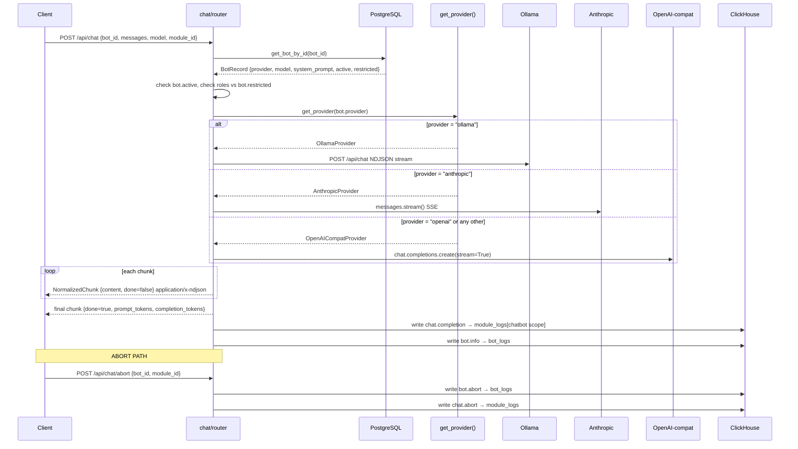

# Chat / LLM Streaming Flow

How a chat request travels from the browser through bot resolution, provider dispatch, and back as an NDJSON stream. Defined in `backend/app/routes/chat/router.py`.

```mermaid
sequenceDiagram
    participant C as Client
    participant R as chat/router
    participant PG as PostgreSQL
    participant GP as get_provider()
    participant OLL as Ollama
    participant ANT as Anthropic
    participant OAI as OpenAI-compat
    participant CH as ClickHouse

    C->>R: POST /api/chat {bot_id, messages, model, module_id}
    R->>PG: get_bot_by_id(bot_id)
    PG-->>R: BotRecord {provider, model, system_prompt, active, restricted}
    R->>R: check bot.active, check roles vs bot.restricted
    R->>GP: get_provider(bot.provider)
    alt provider = "ollama"
        GP-->>R: OllamaProvider
        R->>OLL: POST /api/chat  NDJSON stream
    else provider = "anthropic"
        GP-->>R: AnthropicProvider
        R->>ANT: messages.stream() SSE
    else provider = "openai" or any other
        GP-->>R: OpenAICompatProvider
        R->>OAI: chat.completions.create(stream=True)
    end
    loop each chunk
        R-->>C: NormalizedChunk {content, done=false}  application/x-ndjson
    end
    R-->>C: final chunk {done=true, prompt_tokens, completion_tokens}
    R->>CH: write chat.completion → module_logs[chatbot scope]
    R->>CH: write bot.info → bot_logs

    Note over C,R: ABORT PATH
    C->>R: POST /api/chat/abort {bot_id, module_id}
    R->>CH: write bot.abort → bot_logs
    R->>CH: write chat.abort → module_logs
```
