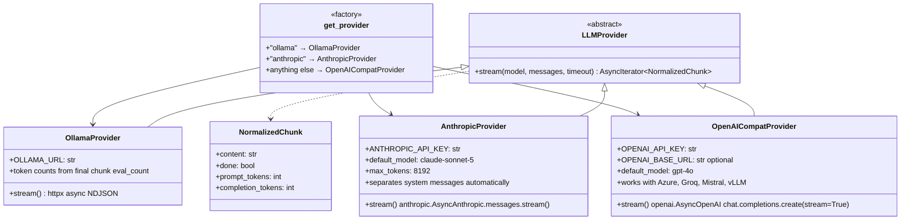

# LLM Provider Class Hierarchy

The `LLMProvider` abstract base class and its three concrete implementations. The `get_provider()` factory dispatches at runtime based on the bot's `provider` field. Defined in `backend/app/providers/`.

