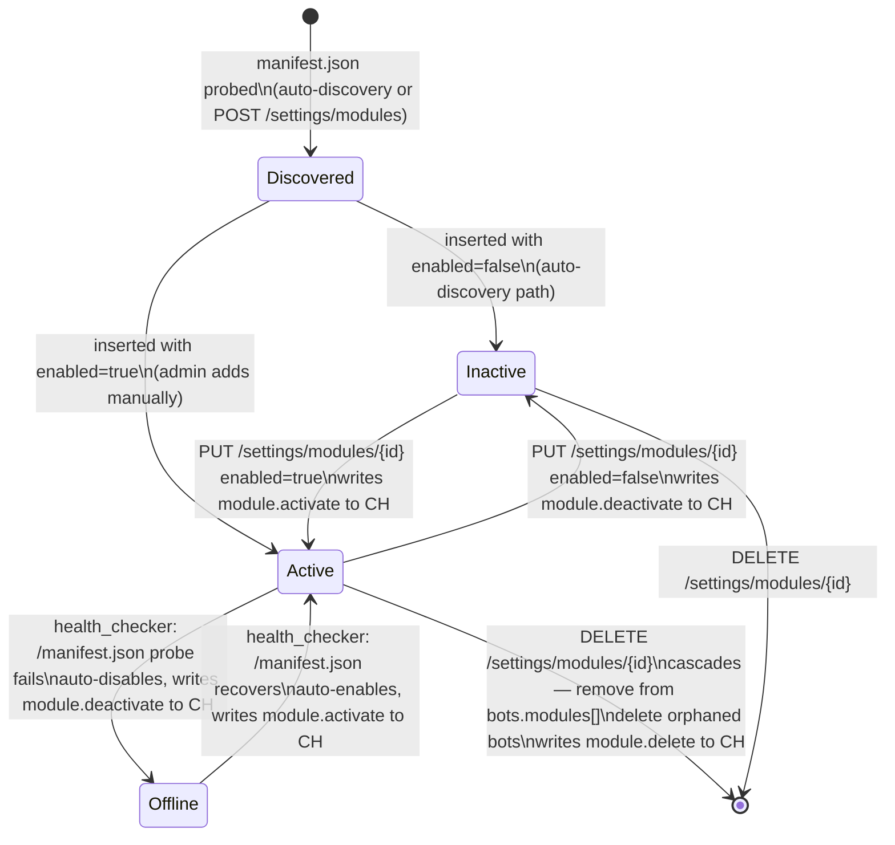

# Module Lifecycle State Machine

The full set of states a module can be in, and the transitions driven by admin actions and the background health checker. Defined in `backend/app/routes/settings/router.py` and the `_module_health_checker` task in `main.py`.

