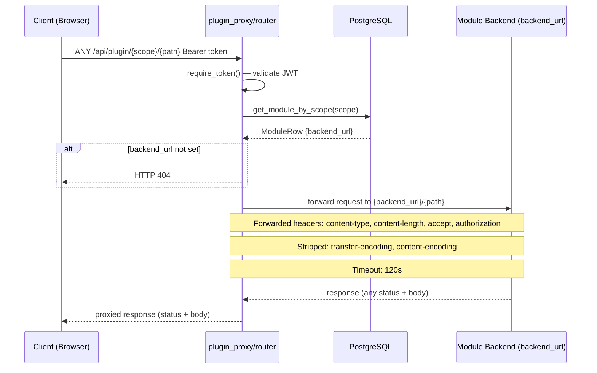

# Plugin Proxy Flow

How `/api/plugin/{scope}/{path}` routes requests to a module's own backend service. The scope is resolved to a `backend_url` stored in PostgreSQL. Defined in `backend/app/routes/plugin_proxy/router.py`.

