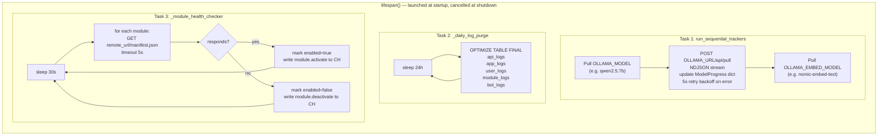

# Background Tasks

Three long-running `asyncio` tasks launched in the FastAPI lifespan and cancelled on shutdown. Defined in `backend/app/main.py`.

```mermaid
graph TB
    subgraph Lifespan["lifespan() — launched at startup, cancelled at shutdown"]
        direction TB

        subgraph T1["Task 1: run_sequential_trackers"]
            T1A["Pull OLLAMA_MODEL\n(e.g. qwen2.5:7b)"]
            T1B["Pull OLLAMA_EMBED_MODEL\n(e.g. nomic-embed-text)"]
            T1C["POST OLLAMA_URL/api/pull\nNDJSON stream\nupdate ModelProgress dict\n5s retry backoff on error"]
            T1A --> T1C
            T1C --> T1B
        end

        subgraph T2["Task 2: _daily_log_purge"]
            T2A["sleep 24h"]
            T2B["OPTIMIZE TABLE FINAL\napi_logs\napp_logs\nuser_logs\nmodule_logs\nbot_logs"]
            T2A --> T2B --> T2A
        end

        subgraph T3["Task 3: _module_health_checker"]
            T3A["sleep 30s"]
            T3B["for each module:\nGET remote_url/manifest.json\ntimeout 5s"]
            T3C{responds?}
            T3D["mark enabled=true\nwrite module.activate to CH"]
            T3E["mark enabled=false\nwrite module.deactivate to CH"]
            T3A --> T3B --> T3C
            T3C -->|yes| T3D --> T3A
            T3C -->|no| T3E --> T3A
        end
    end
```
