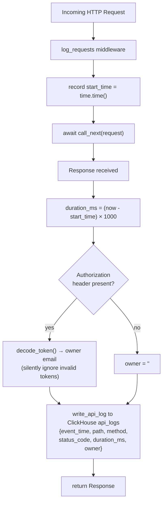

# HTTP Request Logging Middleware

Every HTTP request passes through `log_requests`, which records path, method, status code, duration, and the authenticated user (if any) to ClickHouse `api_logs`. Defined in `backend/app/main.py`.

