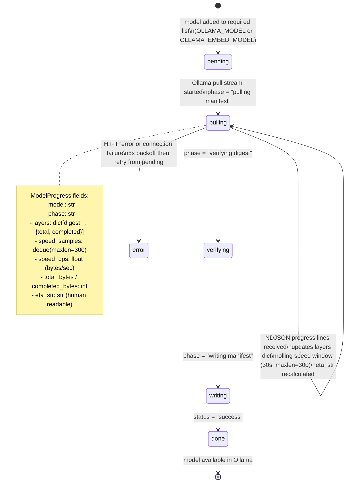

# Model Pull Tracker State Machine

Tracks the download progress of Ollama models. The shared `ModelProgress` dict is consumed by `GET /api/model-status/stream` (SSE) so the frontend can show live pull progress. Defined in `backend/app/model_tracker/`.

