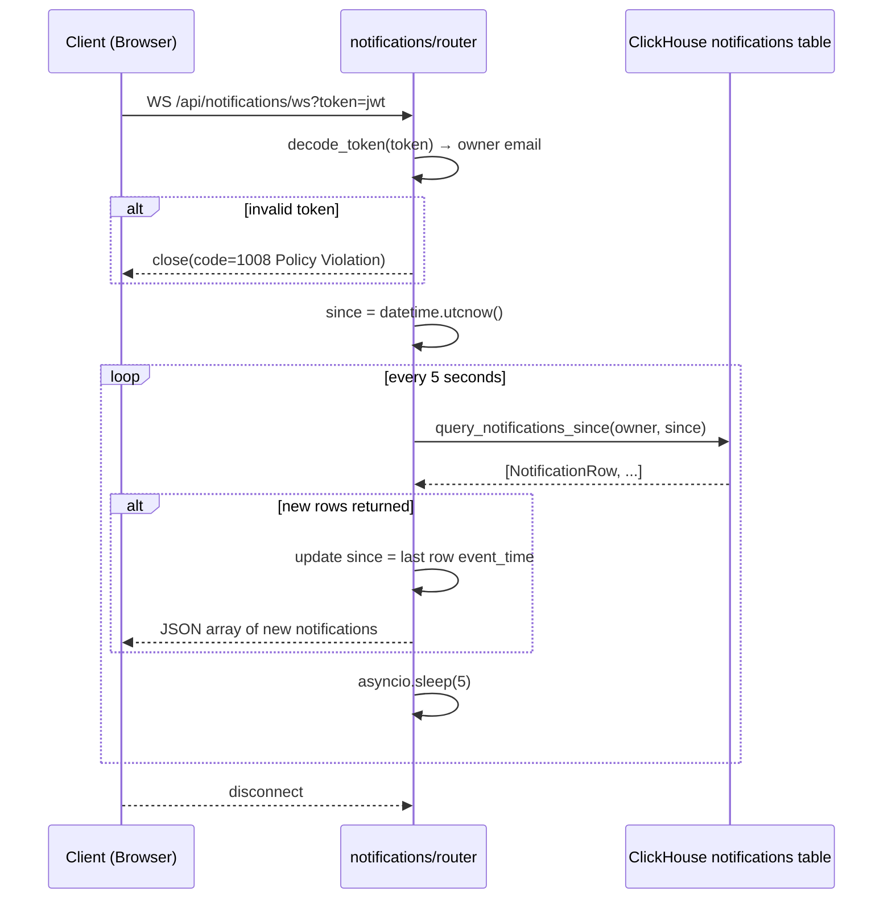

# WebSocket Notifications Flow

The notifications WebSocket authenticates via a JWT query parameter, then polls ClickHouse every 5 seconds for new rows belonging to that user. Defined in `backend/app/routes/notifications/router.py`.

