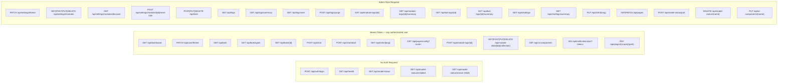

# API Route Map

All 16 routers grouped by required authorization level.

```mermaid
graph LR
    subgraph Public["No Auth Required"]
        PUB1["POST /api/auth/login"]
        PUB2["GET /api/health"]
        PUB3["GET /api/model-status"]
        PUB4["GET /api/model-status/installed"]
        PUB5["GET /api/model-status/stream (SSE)"]
    end

    subgraph Token["Bearer Token — any authenticated user"]
        T1["GET /api/dashboard"]
        T2["PATCH /api/user/theme"]
        T3["GET /api/bots"]
        T4["GET /api/bots/types"]
        T5["GET /api/bots/{id}"]
        T6["POST /api/chat"]
        T7["POST /api/chat/abort"]
        T8["GET /api/i18n/{lang}"]
        T9["GET /api/pages/config?route="]
        T10["POST /api/module-logs/{id}"]
        T11["GET|POST|PUT|DELETE /api/module-data/{id}/{collection}"]
        T12["GET /api/ui-components"]
        T13["WS /api/notifications/ws?token="]
        T14["ANY /api/plugin/{scope}/{path}"]
    end

    subgraph Admin["Admin Role Required"]
        A1["PATCH /api/settings/theme"]
        A2["GET|POST|PUT|DELETE /api/settings/modules"]
        A3["GET /api/settings/modules/discover"]
        A4["POST /api/settings/modules/{id}/reset-i18n"]
        A5["POST|PUT|DELETE /api/bots"]
        A6["GET /api/logs"]
        A7["GET /api/logs/summary"]
        A8["GET /api/logs/user"]
        A9["POST /api/logs/purge"]
        A10["GET /api/module-logs/{id}"]
        A11["GET /api/module-logs/{id}/summary"]
        A12["GET /api/bot-logs/{id}"]
        A13["GET /api/bot-logs/{id}/summary"]
        A14["GET /api/chat/logs"]
        A15["GET /api/chat/logs/summary"]
        A16["PUT /api/i18n/{lang}"]
        A17["GET|PATCH /api/pages"]
        A18["POST /api/model-status/pull"]
        A19["DELETE /api/model-status/{name}"]
        A20["PUT /api/ui-components/{name}"]
    end
```
