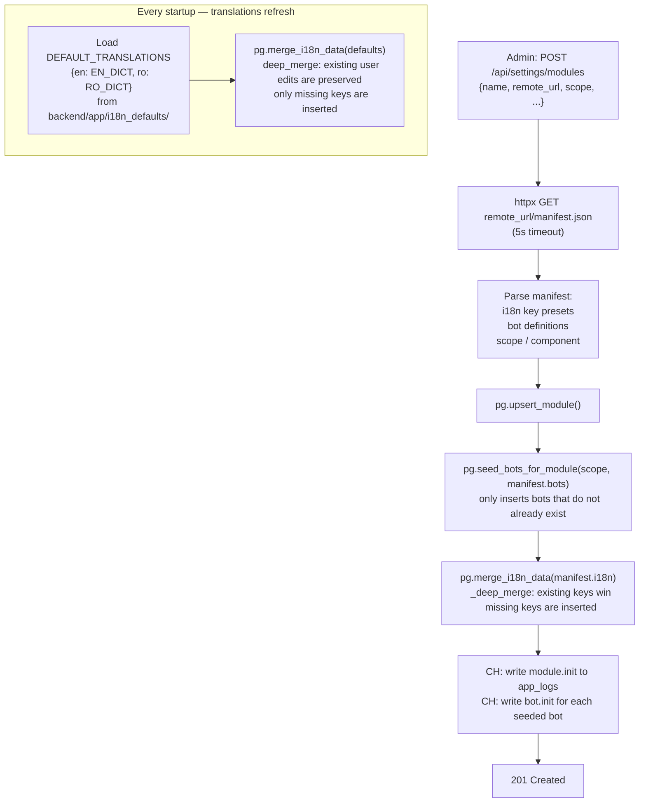

# Module Registration & i18n Merge Flow

What happens when an admin registers a new module, and how translations are deep-merged without overwriting user edits. Defined in `backend/app/routes/settings/router.py` and `backend/app/db/postgres/adapter.py`.

