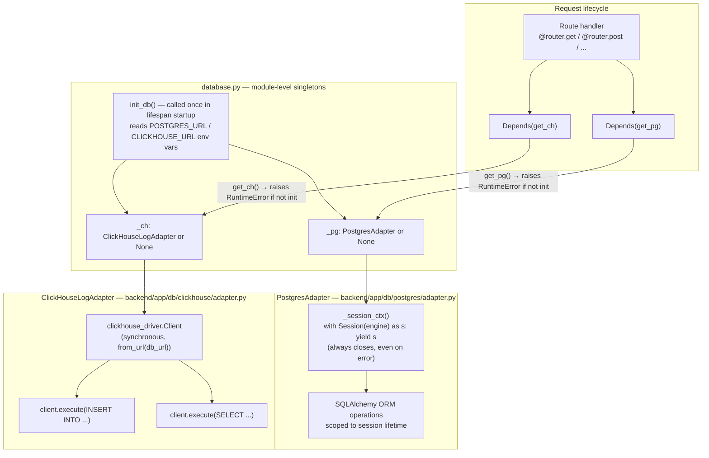

# Database Dependency Chain

How FastAPI routes get access to the database adapters via `Depends()`, and how the singletons are initialised once at startup. Defined in `backend/app/database.py` and `backend/app/deps/`.

