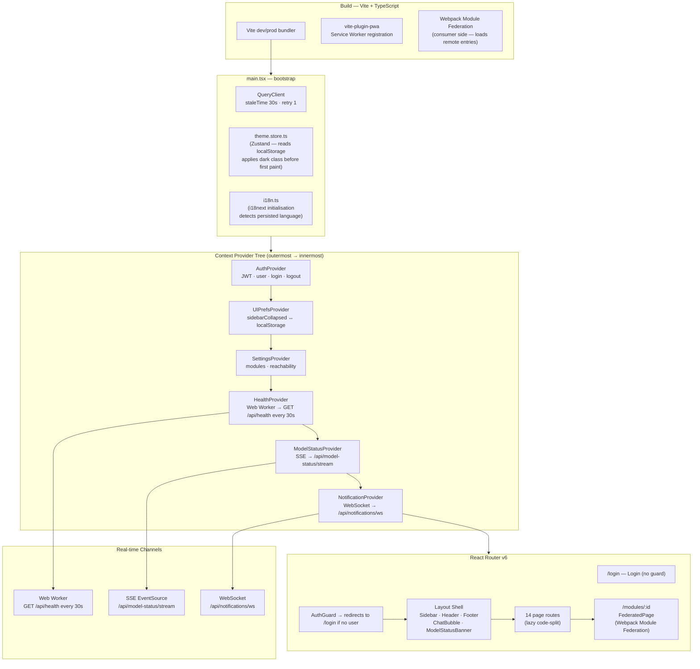

# Frontend Overall Architecture

Top-level view of the React 19 SPA — build tooling, provider tree, router, and real-time channels.

```mermaid
graph TB
    subgraph Build["Build — Vite + TypeScript"]
        VITE["Vite dev/prod bundler"]
        PWA["vite-plugin-pwa\nService Worker registration"]
        MF["Webpack Module Federation\n(consumer side — loads remote entries)"]
    end

    subgraph Entry["main.tsx — bootstrap"]
        QC["QueryClient\nstaleTime 30s · retry 1"]
        STORE["theme.store.ts\n(Zustand — reads localStorage\napplies dark class before first paint)"]
        I18N["i18n.ts\n(i18next initialisation\ndetects persisted language)"]
    end

    subgraph Providers["Context Provider Tree (outermost → innermost)"]
        P1["AuthProvider\nJWT · user · login · logout"]
        P2["UIPrefsProvider\nsidebarCollapsed ↔ localStorage"]
        P3["SettingsProvider\nmodules · reachability"]
        P4["HealthProvider\nWeb Worker → GET /api/health every 30s"]
        P5["ModelStatusProvider\nSSE → /api/model-status/stream"]
        P6["NotificationProvider\nWebSocket → /api/notifications/ws"]
    end

    subgraph Router["React Router v6"]
        LOGIN["/login — Login (no guard)"]
        GUARD["AuthGuard → redirects to /login if no user"]
        LAYOUT["Layout Shell\nSidebar · Header · Footer\nChatBubble · ModelStatusBanner"]
        PAGES["14 page routes\n(lazy code-split)"]
        FEDERATED["/modules/:id\nFederatedPage\n(Webpack Module Federation)"]
    end

    subgraph RealtimeChannels["Real-time Channels"]
        WW["Web Worker\nGET /api/health every 30s"]
        SSE["SSE EventSource\n/api/model-status/stream"]
        WS["WebSocket\n/api/notifications/ws"]
    end

    VITE --> Entry
    Entry --> Providers
    P1 --> P2 --> P3 --> P4 --> P5 --> P6
    P6 --> Router
    GUARD --> LAYOUT --> PAGES
    PAGES --> FEDERATED
    P4 --> WW
    P5 --> SSE
    P6 --> WS
```
