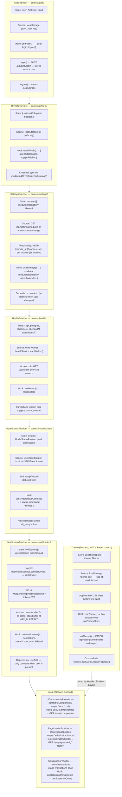

# Provider / Context Tree

Every React context provider, what state it holds, how it gets data, and which hook exposes it.

```mermaid
graph TD
    subgraph AUTH["AuthProvider — context/auth/"]
        A1["State: user: AuthUser | null"]
        A2["Source: localStorage (auth_user key)"]
        A3["Hook: useAuth() → { user, login, logout }"]
        A4["login() → POST /api/auth/login → stores token + user"]
        A5["logout() → clears localStorage"]
    end

    subgraph UIPREFS["UIPrefsProvider — context/uiPrefs/"]
        U1["State: { sidebarCollapsed: boolean }"]
        U2["Source: localStorage (ui-prefs key)"]
        U3["Hook: useUIPrefs() → { sidebarCollapsed, toggleSidebar }"]
        U4["Cross-tab sync via window.addEventListener('storage')"]
    end

    subgraph SETTINGS["SettingsProvider — context/settings/"]
        S1["State: modules[], moduleReachability: Record<id, boolean>"]
        S2["Source: GET /api/settings/modules on mount + user change"]
        S3["Reachability: HEAD {remote_url}/manifest.json per module (3s timeout)"]
        S4["Hook: useSettings() → { modules, moduleReachability, refreshModules }"]
        S5["Depends on: useAuth (re-fetches when user changes)"]
    end

    subgraph HEALTH["HealthProvider — context/health/"]
        H1["State: { api, postgres, clickhouse, checkedAt, translations? }"]
        H2["Source: Web Worker → healthService.startWorker()"]
        H3["Worker polls GET /api/health every 30 seconds"]
        H4["Hook: useHealth() → HealthState"]
        H5["translations version map triggers i18n hot-reload"]
    end

    subgraph MODELSTATUS["ModelStatusProvider — context/modelStatus/"]
        M1["State: { status: ModelStatusPayload | null, dismissed }"]
        M2["Source: useModelStatus() hook — SSE EventSource"]
        M3["SSE at /api/model-status/stream"]
        M4["Hook: useModelStatusContext() → { status, dismissed, dismiss }"]
        M5["Auto-dismisses when all_ready = true"]
    end

    subgraph NOTIF["NotificationProvider — context/notification/"]
        N1["State: notifications[], unreadCount, markAllRead"]
        N2["Source: notificationService.connect(token) → WebSocket"]
        N3["WS at ws[s]://host/api/notifications/ws?token=JWT"]
        N4["Auto-reconnects after 3s on close; caps buffer at MAX_BUFFERED"]
        N5["Hook: useNotifications() → { notifications, unreadCount, markAllRead }"]
        N6["Depends on: useAuth — only connects when user is present"]
    end

    subgraph THEME["Theme (Zustand, NOT a React context)"]
        T1["Store: useThemeStore — theme: Theme"]
        T2["Source: localStorage (theme key) — read at module load"]
        T3["Applies dark CSS class before first paint"]
        T4["Hook: useTheme() → thin adapter over useThemeStore"]
        T5["setTheme() → PATCH /api/settings/theme (fire-and-forget)"]
        T6["Cross-tab via window.addEventListener('storage')"]
    end

    subgraph LOCAL["Local / Scoped Contexts"]
        L1["UIComponentsProvider — context/uiComponents/\nwraps DocsUI only\nHook: useUIComponents() → GET /api/ui-components"]
        L2["PageLoaderProvider — context/pageLoader/\nwraps Outlet inside Layout\nHook: usePageConfig() → GET /api/pages/config?route="]
        L3["TranslationsProvider — hooks/translations/\nwraps Translations page\nHook: useTranslationsContext() → useSuspenseQuery"]
    end

    AUTH --> UIPREFS --> SETTINGS --> HEALTH --> MODELSTATUS --> NOTIF
    NOTIF --> LOCAL
    THEME -.->|"used by Header, Sidebar, Layout"| LOCAL
```
