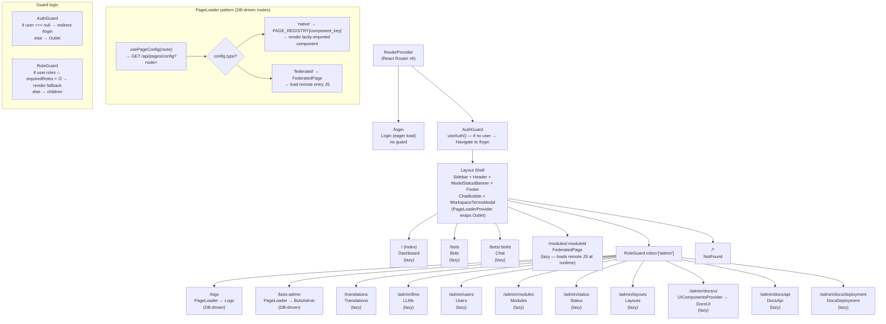

# React Router Map & Guards

All routes, access guards, lazy-loading strategy, and the DB-driven PageLoader pattern.

```mermaid
graph TD
    ROOT["RouterProvider\n(React Router v6)"]

    ROOT --> LOGIN["/login\nLogin (eager load)\nno guard"]
    ROOT --> AUTHGUARD["AuthGuard\nuseAuth() — if no user → Navigate to /login"]

    AUTHGUARD --> LAYOUT["Layout Shell\nSidebar + Header + ModelStatusBanner + Footer\nChatBubble + WorkspaceTermsModal\n(PageLoaderProvider wraps Outlet)"]

    LAYOUT --> IDX["/ (index)\nDashboard\n(lazy)"]

    LAYOUT --> BOTS["/bots\nBots\n(lazy)"]
    LAYOUT --> BOTID["/bots/:botId\nChat\n(lazy)"]

    LAYOUT --> MODULES["/modules/:moduleId\nFederatedPage\n(lazy — loads remote JS at runtime)"]

    LAYOUT --> LOGSGUARD["RoleGuard roles=['admin']"]
    LOGSGUARD --> LOGS["/logs\nPageLoader → Logs\n(DB-driven)"]
    LOGSGUARD --> BOTSADMIN["/bots-admin\nPageLoader → BotsAdmin\n(DB-driven)"]
    LOGSGUARD --> TRANS["/translations\nTranslations\n(lazy)"]
    LOGSGUARD --> LLMS["/admin/llms\nLLMs\n(lazy)"]
    LOGSGUARD --> USERS["/admin/users\nUsers\n(lazy)"]
    LOGSGUARD --> MODS["/admin/modules\nModules\n(lazy)"]
    LOGSGUARD --> STATUS["/admin/status\nStatus\n(lazy)"]
    LOGSGUARD --> LAYOUTS["/admin/layouts\nLayouts\n(lazy)"]
    LOGSGUARD --> DOCSUI["/admin/docs/ui\nUIComponentsProvider → DocsUI\n(lazy)"]
    LOGSGUARD --> DOCSAPI["/admin/docs/api\nDocsApi\n(lazy)"]
    LOGSGUARD --> DOCSDEPLOY["/admin/docs/deployment\nDocsDeployment\n(lazy)"]

    LAYOUT --> NOTFOUND["/*\nNotFound"]

    subgraph PageLoader["PageLoader pattern (DB-driven routes)"]
        PL1["usePageConfig(route)\n→ GET /api/pages/config?route="]
        PL2{"config.type?"}
        PL3["'native' → PAGE_REGISTRY[component_key]\n→ render lazily-imported component"]
        PL4["'federated' → FederatedPage\n→ load remote entry JS"]
        PL1 --> PL2 --> PL3
        PL2 --> PL4
    end

    subgraph Guards["Guard logic"]
        AG["AuthGuard\nif user === null → redirect /login\nelse → Outlet"]
        RG["RoleGuard\nif user.roles ∩ requiredRoles = ∅ → render fallback\nelse → children"]
    end
```
