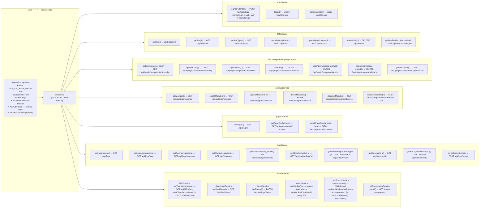

# Service Layer Map

Every service file, its methods, and the backend endpoints they call. All go through `apiService` which attaches `Authorization: Bearer <token>` and enforces a 15-second timeout.

