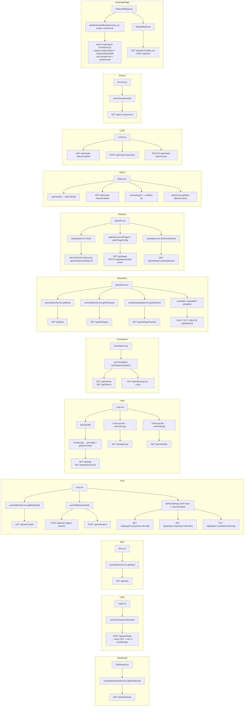

# Page → Hook → Service → API Data Flow

How each page fetches and mutates data.

```mermaid
graph LR
    subgraph Dashboard
        D1["Dashboard.tsx"] --> D2["useGet(dashboardService.getDashboard)"]
        D2 --> D3["GET /api/dashboard"]
    end

    subgraph Login
        LG1["Login.tsx"] --> LG2["useAuth().login(credentials)"]
        LG2 --> LG3["POST /api/auth/login\n→ stores JWT + user in localStorage"]
    end

    subgraph Bots
        B1["Bots.tsx"] --> B2["useGet(botsService.getBots)"]
        B2 --> B3["GET /api/bots"]
    end

    subgraph Chat
        CH1["Chat.tsx"] --> CH2["useGet(botsService.getBot(botId))"]
        CH2 --> CH3["GET /api/bots/:botId"]
        CH1 --> CH4["useChatStream(botId)"]
        CH4 --> CH5["POST /api/chat (ndjson stream)"]
        CH4 --> CH6["POST /api/chat/abort"]
        CH1 --> CH7["BotConfigPage (when type ≠ communicator)"]
        CH7 --> CH8["GET /api/plugin/:scope/bots/:id/config"]
        CH7 --> CH9["GET /api/plugin/:scope/bots/:id/entities"]
        CH7 --> CH10["PUT /api/plugin/:scope/bots/:id/config"]
    end

    subgraph Logs
        LO1["Logs.tsx"] --> LO2["ApiLogsTab"]
        LO2 --> LO3["useApiLogs → getLogs() + getSummary()"]
        LO3 --> LO4["GET /api/logs\nGET /api/logs/summary"]
        LO1 --> LO5["UserLogsTab → useUserLogs"]
        LO5 --> LO6["GET /api/logs/user"]
        LO1 --> LO7["ChatLogsTab → useChatLogs"]
        LO7 --> LO8["GET /api/chat/logs"]
    end

    subgraph Translations
        TR1["Translations.tsx"] --> TR2["useTranslations (useSuspenseQuery)"]
        TR2 --> TR3["GET /api/i18n/en\nGET /api/i18n/ro"]
        TR2 --> TR4["PUT /api/i18n/:lang (on save)"]
    end

    subgraph BotsAdmin
        BA1["BotsAdmin.tsx"] --> BA2["useGet(botsService.getBots)"]
        BA2 --> BA3["GET /api/bots"]
        BA1 --> BA4["useGet(botsService.getBotTypes)"]
        BA4 --> BA5["GET /api/bots/types"]
        BA1 --> BA6["useGet(settingsService.getModules)"]
        BA6 --> BA7["GET /api/settings/modules"]
        BA1 --> BA8["createBot / updateBot / deleteBot"]
        BA8 --> BA9["POST / PUT / DELETE /api/bots[/:id]"]
    end

    subgraph Modules
        MO1["Modules.tsx"] --> MO2["settingsService CRUD"]
        MO2 --> MO3["GET/POST/PUT/DELETE /api/settings/modules[/:id]"]
        MO1 --> MO4["pagesService.listPages + patchPageConfig"]
        MO4 --> MO5["GET /api/pages\nPATCH /api/pages/config?route="]
        MO1 --> MO6["settingsService.discoverModules"]
        MO6 --> MO7["GET /api/settings/modules/discover"]
    end

    subgraph Status
        ST1["Status.tsx"] --> ST2["useHealth() — Web Worker"]
        ST1 --> ST3["GET /api/model-status/installed"]
        ST1 --> ST4["useSettings() — modules list"]
        ST1 --> ST5["botsService.getBots (filtered active)"]
    end

    subgraph LLMsPage["LLMs"]
        LL1["LLMs.tsx"] --> LL2["GET /api/model-status/installed"]
        LL1 --> LL3["POST /api/model-status/pull"]
        LL1 --> LL4["DELETE /api/model-status/:name"]
    end

    subgraph DocsUI
        DU1["DocsUI.tsx"] --> DU2["useUIComponents()"]
        DU2 --> DU3["GET /api/ui-components"]
    end

    subgraph FederatedPage
        FP1["FederatedPage.tsx"] --> FP2["loadFederatedModule(remote_url, scope, component)"]
        FP2 --> FP3["inject script tag for remoteEntry.js\nexpose window.React + window.ReactDOM\ncall container.init + container.get"]
        FP1 --> FP4["ModuleBotPanel"]
        FP4 --> FP5["GET /api/bots?module_id=\nPOST /api/chat"]
    end
```
