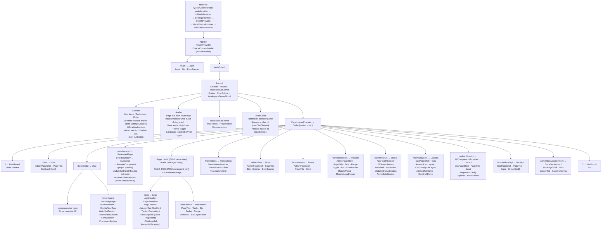

# Component Hierarchy

Full React component tree from the root mount point to leaf components.

```mermaid
graph TD
    MAIN["main.tsx\nQueryClientProvider\nAuthProvider → UIPrefsProvider\n→ SettingsProvider → HealthProvider\n→ ModelStatusProvider → NotificationProvider"]

    MAIN --> APP["App.tsx\nRouterProvider\nCookieConsentModal (outside router)"]

    APP --> LOGIN["/login → Login\nInput · Btn · ErrorBanner"]

    APP --> AUTHGUARD["AuthGuard"]
    AUTHGUARD --> LAYOUT["Layout\nSidebar · Header · ModelStatusBanner\nFooter · ChatBubble · WorkspaceTermsModal"]

    LAYOUT --> SIDEBAR["Sidebar\nNav items (Dashboard, Bots)\nDynamic module entries (from SettingsContext)\nOfflineModuleItem\nAdmin section (if admin role)\nSign-out button"]

    LAYOUT --> HEADER["Header\nPage title from route map\nHealth indicator (red pulse if degraded)\nUser avatar dropdown:\n  Theme toggle\n  Language toggle (EN/RO)\n  Logout"]

    LAYOUT --> MSB["ModelStatusBanner\nModelRow · ProgressBar\nDismiss button"]

    LAYOUT --> CHATBUBBLE["ChatBubble\nBot/model selector panel\nStreaming chat UI (useChatStream)\nPersists history to localStorage"]

    LAYOUT --> OUTLET["PageLoaderProvider → Outlet (route content)"]

    OUTLET --> DASHBOARD["/ → Dashboard\nStatic content"]

    OUTLET --> BOTSPAGE["/bots → Bots\nAdminPageShell · PageTitle\nBotCard[] (grid)"]

    OUTLET --> CHAT["/bots/:botId → Chat"]
    CHAT --> CHATUI["(communicator type)\nStreaming chat UI"]
    CHAT --> BOTCONFIG["(other types)\nBotConfigPage\nSectionHeader · ConfigFieldRow\nWatchlistSection · RiskProfilesSection\nTeamsSection · ProcessesSection"]

    OUTLET --> FEDERATED["/modules/:id → FederatedPage\nErrorBoundary → Suspense\n→ RemoteComponent (props: presets)\nModuleBotPanel (floating bot chat)\nModuleOfflineFallback (when unreachable)"]

    OUTLET --> PAGELOADER["PageLoader (DB-driven routes)\nreads usePageConfig()\n→ PAGE_REGISTRY[component_key] OR FederatedPage"]

    PAGELOADER --> LOGSPAGE["/logs → Logs\nLogsHeader · LogsTimeFilter\nLogsContent:\n  ApiLogsTab (StatCard · Table · Pagination)\n  UserLogsTab (Table · Pagination)\n  ChatLogsTab (expandable replay)"]

    PAGELOADER --> BOTSADMIN["/bots-admin → BotsAdmin\nPageTitle · Table · Btn · Badge · Toggle\nBotModal · BotLogsDrawer"]

    OUTLET --> TRANS["/translations → Translations\nTranslationsProvider:\n  TranslationsToolbar\n  TranslationsGrid"]

    OUTLET --> LLMS["/admin/llms → LLMs\nAdminPageShell · PageTitle\nBtn · Spinner · ErrorBanner"]

    OUTLET --> USERS["/admin/users → Users\nAdminPageShell · PageTitle · Card"]

    OUTLET --> MODSPAGE["/admin/modules → Modules\nAdminPageShell · PageTitle · Tabs · Badge\nToggle · Btn · ErrorBanner\nModuleModal · ModuleLogsDrawer"]

    OUTLET --> STATUS["/admin/status → Status\nAppHealthSection\nDbStatusSection\nInstalledLLMsSection\nModulesStatusSection\nActiveBotsSection"]

    OUTLET --> LAYOUTS["/admin/layouts → Layouts\nDocPageShell · Tabs\nAnomaScanLayout · CloudInsightAILayout\nAdminShellDemo · DocShellDemo"]

    OUTLET --> DOCSUI["/admin/docs/ui → UIComponentsProvider → DocsUI\nDocPageShell · PageTitle · Input\nComponentCard[] · Spinner · ErrorBanner"]

    OUTLET --> DOCSAPI["/admin/docs/api → DocsApi\nDocPageShell · PageTitle · Input · GroupCard[]"]

    OUTLET --> DOCSDEPLOY["/admin/docs/deployment → DocsDeployment\nDocPageShell · Tabs\nDockerTab · KubernetesTab"]

    OUTLET --> NOTFOUND["/* → NotFound\nBtn"]
```
