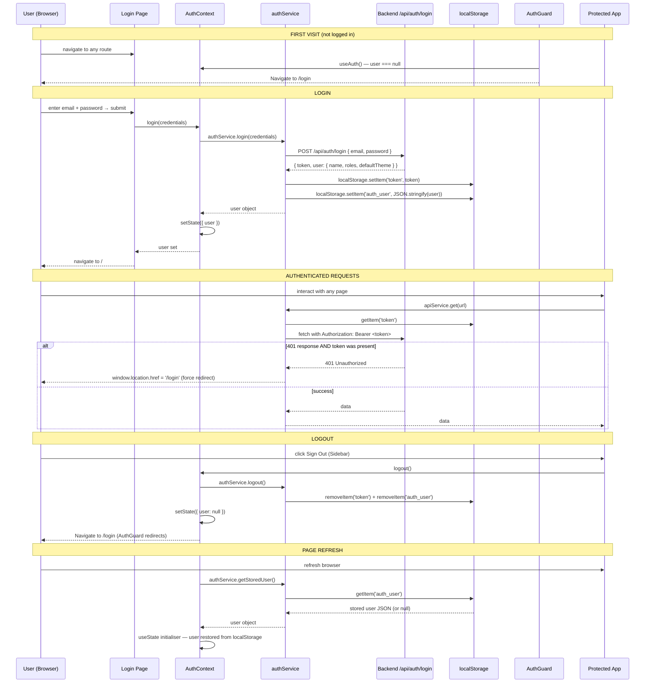

# Authentication Flow

Login, token storage, route protection, and logout. Defined in `context/auth/`, `services/auth/`, `components/guards/`.

```mermaid
sequenceDiagram
    participant U as User (Browser)
    participant LP as Login Page
    participant AC as AuthContext
    participant AS as authService
    participant API as Backend /api/auth/login
    participant LS as localStorage
    participant AG as AuthGuard
    participant APP as Protected App

    Note over U,APP: FIRST VISIT (not logged in)
    U->>LP: navigate to any route
    AG->>AC: useAuth() — user === null
    AG-->>U: Navigate to /login

    Note over U,APP: LOGIN
    U->>LP: enter email + password → submit
    LP->>AC: login(credentials)
    AC->>AS: authService.login(credentials)
    AS->>API: POST /api/auth/login { email, password }
    API-->>AS: { token, user: { name, roles, defaultTheme } }
    AS->>LS: localStorage.setItem('token', token)
    AS->>LS: localStorage.setItem('auth_user', JSON.stringify(user))
    AS-->>AC: user object
    AC->>AC: setState({ user })
    AC-->>LP: user set
    LP-->>U: navigate to /

    Note over U,APP: AUTHENTICATED REQUESTS
    U->>APP: interact with any page
    APP->>AS: apiService.get(url)
    AS->>LS: getItem('token')
    AS->>API: fetch with Authorization: Bearer <token>
    alt 401 response AND token was present
        API-->>AS: 401 Unauthorized
        AS-->>U: window.location.href = '/login' (force redirect)
    else success
        API-->>AS: data
        AS-->>APP: data
    end

    Note over U,APP: LOGOUT
    U->>APP: click Sign Out (Sidebar)
    APP->>AC: logout()
    AC->>AS: authService.logout()
    AS->>LS: removeItem('token') + removeItem('auth_user')
    AC->>AC: setState({ user: null })
    AC-->>U: Navigate to /login (AuthGuard redirects)

    Note over U,APP: PAGE REFRESH
    U->>APP: refresh browser
    AC->>AS: authService.getStoredUser()
    AS->>LS: getItem('auth_user')
    LS-->>AS: stored user JSON (or null)
    AS-->>AC: user object
    AC->>AC: useState initialiser — user restored from localStorage
```
