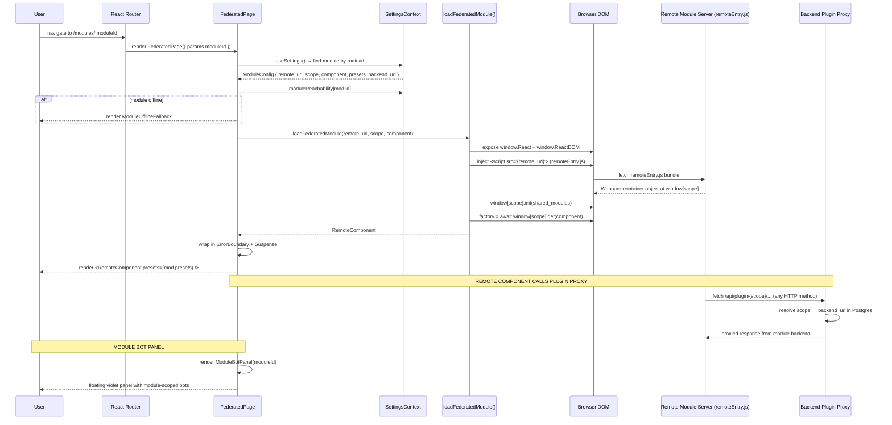

# Module Federation Flow

How the shell loads a remote micro-frontend at runtime using Webpack Module Federation.

## Key concepts

| Term | Meaning |
|---|---|
| `remote_url` | URL to the module's `remoteEntry.js` (e.g. `http://localhost:3001/remoteEntry.js`) |
| `scope` | Webpack federation container name (unique per module, stored in Postgres `modules.scope`) |
| `component` | Exposed component path inside the container (e.g. `./App`) |
| `presets` | JSON payload (`{ i18n, layout, settings }`) injected as props — the shell's way of passing config to the remote |
| `moduleReachability` | Live reachability map from `SettingsContext` — `false` means show fallback, don't attempt load |
