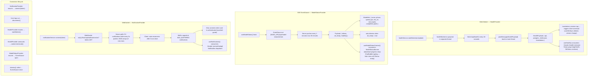

# Real-time Channels

Three independent real-time mechanisms: Web Worker (health), SSE (model status), WebSocket (notifications).

```mermaid
graph TB
    subgraph WW["Web Worker — HealthProvider"]
        WW1["healthService.startWorker(onUpdate)"]
        WW2["healthWorker.ts spawned in separate thread"]
        WW3["fetch('/api/health') every 30 seconds"]
        WW4["postMessage(HealthPayload) back to main thread"]
        WW5["HealthPayload: { api, postgres, clickhouse, translations }"]
        WW6["translations version map → triggers i18n hot-reload\n(useI18nSync detects version change)"]
        WW1 --> WW2 --> WW3 --> WW4 --> WW5 --> WW6
        WW7["useHealth() consumers:\n  Header (health indicator)\n  Status page (AppHealth, DbStatus sections)"]
        WW5 --> WW7
    end

    subgraph SSE["SSE EventSource — ModelStatusProvider"]
        S1["useModelStatus() hook"]
        S2["EventSource at {BASE_URL}/api/model-status/stream"]
        S3["Server pushes every 1 second; max 30 minutes"]
        S4["Payload: { ollama, all_ready, models[] }"]
        S5["ModelInfo: { name, phase, speed_bps, eta_str,\n  total_bytes, completed_bytes }"]
        S1 --> S2 --> S3 --> S4 --> S5
        S6["auto-dismiss when all_ready = true"]
        S4 --> S6
        S7["useModelStatusContext() consumers:\n  ModelStatusBanner (download progress strip)\n  ChatBubble (gating — hide chat until Ollama ready)"]
        S4 --> S7
    end

    subgraph WS["WebSocket — NotificationProvider"]
        N1["notificationService.connect(token)"]
        N2["WebSocket ws[s]://host/api/notifications/ws?token=JWT"]
        N3["Server polls CH notifications table every 5s\npushes JSON arrays of new rows"]
        N4["Client: auto-reconnects after 3s on close"]
        N5["Buffer capped at MAX_BUFFERED notifications"]
        N1 --> N2 --> N3 --> N4 --> N5
        N6["Only connects when user is authenticated (useAuth guard)"]
        N7["useNotifications() consumers:\n  Header (unread badge)\n  Notification dropdown"]
        N5 --> N6
        N5 --> N7
    end

    subgraph Lifecycle["Connection lifecycle"]
        L1["NotificationProvider mounts → connect(token)"]
        L2["User logs out → disconnect()"]
        L3["HealthProvider mounts → startWorker()"]
        L4["HealthProvider unmounts → worker.terminate()"]
        L5["ModelStatusProvider mounts → EventSource open"]
        L6["dismiss() called → EventSource close"]
    end
```
