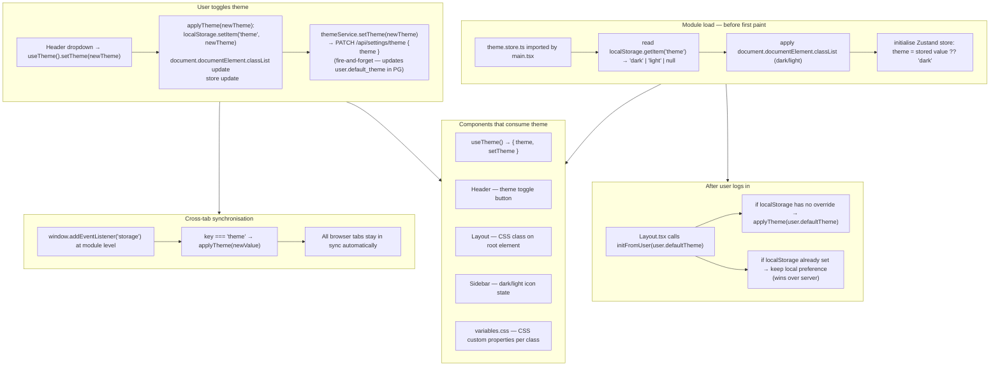

# Theme System

Zustand-based theme (not a React context), with cross-tab sync, server persistence, and user-preference initialisation.

```mermaid
flowchart TD
    subgraph Init["Module load — before first paint"]
        I1["theme.store.ts imported by main.tsx"]
        I2["read localStorage.getItem('theme') → 'dark' | 'light' | null"]
        I3["apply document.documentElement.classList (dark/light)"]
        I4["initialise Zustand store: theme = stored value ?? 'dark'"]
        I1 --> I2 --> I3 --> I4
    end

    subgraph Login["After user logs in"]
        L1["Layout.tsx calls initFromUser(user.defaultTheme)"]
        L2["if localStorage has no override → applyTheme(user.defaultTheme)"]
        L3["if localStorage already set → keep local preference (wins over server)"]
        L1 --> L2
        L1 --> L3
    end

    subgraph Toggle["User toggles theme"]
        T1["Header dropdown → useTheme().setTheme(newTheme)"]
        T2["applyTheme(newTheme):\n  localStorage.setItem('theme', newTheme)\n  document.documentElement.classList update\n  store update"]
        T3["themeService.setTheme(newTheme)\n→ PATCH /api/settings/theme { theme }\n(fire-and-forget — updates user.default_theme in PG)"]
        T1 --> T2 --> T3
    end

    subgraph CrossTab["Cross-tab synchronisation"]
        C1["window.addEventListener('storage') at module level"]
        C2["key === 'theme' → applyTheme(newValue)"]
        C3["All browser tabs stay in sync automatically"]
        C1 --> C2 --> C3
    end

    subgraph Consumers["Components that consume theme"]
        CO1["useTheme() → { theme, setTheme }"]
        CO2["Header — theme toggle button"]
        CO3["Layout — CSS class on root element"]
        CO4["Sidebar — dark/light icon state"]
        CO5["variables.css — CSS custom properties per class"]
    end

    Init --> Login
    Toggle --> CrossTab
    Init --> Consumers
    Toggle --> Consumers
```
