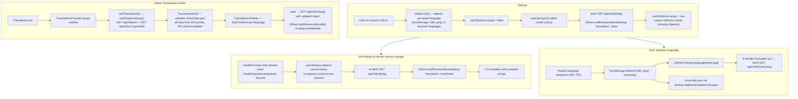

# i18n / Translation System

i18next initialisation, server-driven translation bundles, hot-reload on version change, and the admin Translations editor.

```mermaid
flowchart TD
    subgraph Boot["Startup"]
        B1["main.tsx imports i18n.ts"]
        B2["i18next.init() — detects persisted language\n(localStorage 'i18n_lang' or browser language)"]
        B3["useI18nStore.ready = false"]
        B4["useI18nSync() called inside Layout"]
        B5["fetch GET /api/i18n/{lang}\n→ i18next.addResourceBundle(lang, 'translation', data)"]
        B6["useI18nStore.ready = true\nLayout unblocks (stops showing Spinner)"]
        B1 --> B2 --> B3 --> B4 --> B5 --> B6
    end

    subgraph HotReload["Hot-reload on server version change"]
        HR1["HealthProvider Web Worker\nposts HealthPayload.translations: Record<lang, version>"]
        HR2["useI18nSync detects version bump\n(compares to last known version)"]
        HR3["re-fetch GET /api/i18n/{lang}"]
        HR4["i18next.addResourceBundle(lang, 'translation', freshData)"]
        HR5["UI re-renders with updated strings"]
        HR1 --> HR2 --> HR3 --> HR4 --> HR5
    end

    subgraph LanguageSwitch["User switches language"]
        LS1["Header language dropdown (EN / RO)"]
        LS2["localStorage.setItem('i18n_lang', newLang)"]
        LS3["i18next.changeLanguage(newLang)"]
        LS4["if bundle not loaded yet → fetch GET /api/i18n/{newLang}"]
        LS5["cross-tab sync via window.addEventListener('storage')"]
        LS1 --> LS2 --> LS3 --> LS4
        LS2 --> LS5
    end

    subgraph Admin["Admin Translations Editor"]
        AE1["Translations.tsx"]
        AE2["TranslationsProvider wraps subtree"]
        AE3["useTranslations() → useSuspenseQuery\nGET /api/i18n/en + GET /api/i18n/ro (parallel)"]
        AE4["TranslationsGrid — editable virtual data grid\nall keys from EN bundle; RO column editable"]
        AE5["TranslationsToolbar — Save buttons per language"]
        AE6["save → PUT /api/i18n/{lang} with updated object\n→ i18next.addResourceBundle() to apply immediately"]
        AE1 --> AE2 --> AE3 --> AE4 --> AE5 --> AE6
    end

    Boot --> HotReload
    Boot --> LanguageSwitch
```
