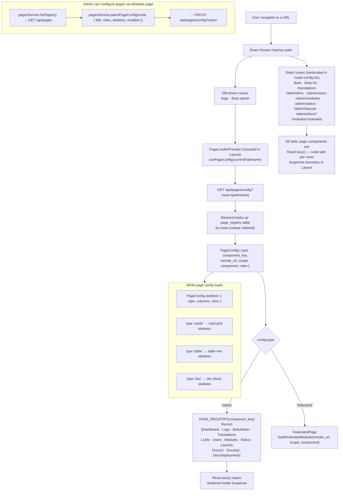

# Page Loading System

Two-tier page resolution: static router for known paths, DB-driven `PageLoader` for configurable pages.

```mermaid
flowchart TD
    NAV["User navigates to a URL"]
    NAV --> ROUTER["React Router matches path"]

    ROUTER --> STATIC["Static routes (hardcoded in router.config.tsx)\n/bots · /bots/:id · /translations\n/admin/llms · /admin/users · /admin/modules\n/admin/status · /admin/layouts · /admin/docs/*\n/modules/:moduleId"]

    ROUTER --> PAGELOADER_ROUTE["DB-driven routes\n/logs · /bots-admin"]

    PAGELOADER_ROUTE --> PLC["PageLoaderProvider (mounted in Layout)\nusePageConfig(currentPathname)"]

    PLC --> API["GET /api/pages/config?route={pathname}"]
    API --> BACKEND["Backend looks up page_registry table\nby route (unique indexed)"]
    BACKEND --> CONFIG["PageConfig { type, component_key,\nremote_url, scope, component, roles }"]

    CONFIG --> TYPE{config.type}

    TYPE -->|"'native'"| REGISTRY["PAGE_REGISTRY[component_key]\nRecord<string, LazyComponent>\n(Dashboard · Logs · BotsAdmin · Translations\n LLMs · Users · Modules · Status · Layouts\n DocsUI · DocsApi · DocsDeployment)"]
    REGISTRY --> NATIVE["React.lazy() import\nrendered inside Suspense"]

    TYPE -->|"'federated'"| FEDPAGE["FederatedPage\nloadFederatedModule(remote_url, scope, component)"]

    STATIC --> LAZYLOAD["All static page components are\nReact.lazy() — code-split per route\nSuspense boundary in Layout"]

    subgraph AdminControl["Admin can configure pages via Modules page"]
        AC1["pagesService.listPages() → GET /api/pages"]
        AC2["pagesService.patchPageConfig(route, { title, roles, skeleton, enabled })"]
        AC3["→ PATCH /api/pages/config?route="]
        AC1 --> AC2 --> AC3
    end

    subgraph Skeleton["While page config loads"]
        SK1["PageConfig.skeleton: { type, columns, rows }"]
        SK2["type 'cards' → card grid skeleton"]
        SK3["type 'table' → table row skeleton"]
        SK4["type 'doc' → doc block skeleton"]
    end

    CONFIG --> Skeleton
```
