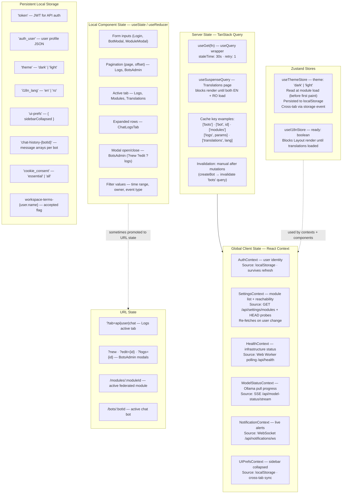

# State Management Overview

Where different kinds of state live in the frontend.

```mermaid
graph TB
    subgraph Server["Server State — TanStack Query"]
        TQ1["useGet(fn) — useQuery wrapper\nstaleTime: 30s · retry: 1"]
        TQ2["useSuspenseQuery — Translations page\nblocks render until both EN + RO load"]
        TQ3["Cache key examples:\n['bots'] · ['bot', id] · ['modules']\n['logs', params] · ['translations', lang]"]
        TQ4["Invalidation: manual after mutations\n(createBot → invalidate 'bots' query)"]
    end

    subgraph Global["Global Client State — React Context"]
        GC1["AuthContext — user identity\nSource: localStorage · survives refresh"]
        GC2["SettingsContext — module list + reachability\nSource: GET /api/settings/modules + HEAD probes\nRe-fetches on user change"]
        GC3["HealthContext — infrastructure status\nSource: Web Worker polling /api/health"]
        GC4["ModelStatusContext — Ollama pull progress\nSource: SSE /api/model-status/stream"]
        GC5["NotificationContext — live alerts\nSource: WebSocket /api/notifications/ws"]
        GC6["UIPrefsContext — sidebar collapsed\nSource: localStorage · cross-tab sync"]
    end

    subgraph Zustand["Zustand Stores"]
        Z1["useThemeStore — theme: 'dark' | 'light'\nRead at module load (before first paint)\nPersisted to localStorage\nCross-tab via storage event"]
        Z2["useI18nStore — ready: boolean\nBlocks Layout render until translations loaded"]
    end

    subgraph Local["Local Component State — useState / useReducer"]
        L1["Form inputs (Login, BotModal, ModuleModal)"]
        L2["Pagination (page, offset) — Logs, BotsAdmin"]
        L3["Active tab — Logs, Modules, Translations"]
        L4["Expanded rows — ChatLogsTab"]
        L5["Modal open/close — BotsAdmin (?new ?edit ?logs)"]
        L6["Filter values — time range, owner, event type"]
    end

    subgraph Persistent["Persistent Local Storage"]
        P1["'token' — JWT for API auth"]
        P2["'auth_user' — user profile JSON"]
        P3["'theme' — 'dark' | 'light'"]
        P4["'i18n_lang' — 'en' | 'ro'"]
        P5["'ui-prefs' — { sidebarCollapsed }"]
        P6["'chat-history-{botId}' — message arrays per bot"]
        P7["'cookie_consent' — 'essential' | 'all'"]
        P8["workspace-terms-{user.name} — accepted flag"]
    end

    subgraph URL["URL State"]
        U1["?tab=api|user|chat — Logs active tab"]
        U2["?new · ?edit={id} · ?logs={id} — BotsAdmin modals"]
        U3["/modules/:moduleId — active federated module"]
        U4["/bots/:botId — active chat bot"]
    end

    Server --> Global
    Zustand -.->|"used by contexts + components"| Global
    Local -.->|"sometimes promoted to URL state"| URL
```
