# UI Primitive Components

All shared UI primitives in `frontend/src/components/ui/`. Every component has a co-located `.style.css` file.

```mermaid
classDiagram
    class Btn {
        +variant: 'primary' | 'secondary' | 'danger'
        +size?: 'sm' | 'md' | 'lg'
        +disabled?: boolean
        +onClick?: handler
        +forwarded: all button attrs
    }
    class Badge {
        +variant: 'info' | 'success' | 'warn' | 'error' | 'neutral'
        +dot?: boolean
        +children: ReactNode
    }
    class Card {
        +children: ReactNode
        +className?: string
    }
    class ErrorBanner {
        +message: string
        renders: red alert box
    }
    class Input {
        +label?: string
        +id?: string
        +forwarded: all input attrs
    }
    class Label {
        +forwarded: all label attrs
        +htmlFor: string
    }
    class Modal {
        +title: string
        +onClose?: handler
        +maxWidth?: string
        +children: ReactNode
        renders: portal overlay
    }
    class PageTitle {
        +children: ReactNode
        renders: bold h1
    }
    class Spinner {
        +size: 'sm' | 'md' | 'lg'
        renders: CSS animated ring
    }
    class Toggle {
        +checked: boolean
        +onChange: handler
        +disabled?: boolean
        role: switch
    }
    class StatCard {
        +value: string | number
        +label: string
        +sub?: string
        renders: KPI metric tile
    }
    class Tabs {
        +tabs: Array of key+label
        +active: string
        +onChange: handler
        fully controlled
    }
    class ProgressBar {
        +value: number 0-100
        +label?: string
        +color?: string
    }
    class Chip {
        +children: ReactNode
        +onRemove?: handler
    }
    class DropZone {
        +onFiles?: handler
        +accept?: string
        +hint?: string
        +file?: File
    }
    class TableGeneric {
        +columns: TableColumn array
        +rows: T array
        +rowKey: keyof T
        +empty?: ReactNode
        +compact?: boolean
        generic T
    }
    class Pagination {
        +page: number
        +totalPages: number
        +onPage: handler
    }
```

## Usage map — which pages use which primitives

| Primitive | Used in |
|---|---|
| `Btn` | Login · Bots · Chat · LLMs · Modules · BotsAdmin · NotFound · DocsUI · Status |
| `Badge` | BotsAdmin · Modules · Sidebar (offline indicator) |
| `Card` | Users · Status sections |
| `ErrorBanner` | Login · Bots · Chat · LLMs · Modules · BotsAdmin · DocsUI |
| `Input` | Login · DocsUI (search) · DocsApi (search) |
| `Label` | Login · BotModal · ModuleModal |
| `Modal` | BotModal (BotsAdmin) · ModuleModal (Modules) |
| `PageTitle` | Bots · LLMs · Users · Modules · BotsAdmin · DocsUI · DocsApi |
| `Spinner` | All pages with async data |
| `Toggle` | BotsAdmin · Modules |
| `StatCard` | ApiLogsTab (Logs) · Status sections |
| `Tabs` | Logs · Modules · Translations · Layouts · DocsDeployment |
| `ProgressBar` | ModelStatusBanner (model download) |
| `Chip` | BotModal (modules[] field) |
| `DropZone` | BotConfigPage (document upload) |
| `Table` | ApiLogsTab · UserLogsTab · BotsAdmin |
| `Pagination` | ApiLogsTab · UserLogsTab · BotsAdmin |
